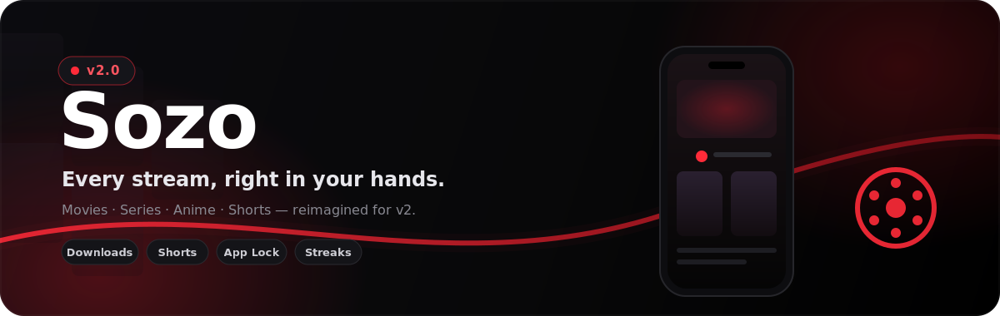

  

  <h1>Sozo v2</h1>
  
A modern Flutter streaming app for movies, series, and anime.

  

    
    
    
  

## About

Sozo is built around a simple, elegant streaming experience for discovering, watching, and downloading content. The name Sozo means "creation" or "imagination" in Japanese, matching the app's anime-inspired identity and polished dark interface.

## Why Sozo

Sozo focuses on a cinematic mobile experience: fast browsing, clean visuals, smooth playback, and a layout that feels made for everyday watching. From home discovery to offline downloads, every screen is designed to keep the content first.

## Highlights

- Discover movies, series, and anime from a clean home feed.
- Explore details, cast, related titles, and screenshots before watching.
- Watch with subtitles, episodes, quality options, and picture-in-picture.
- Save favorites, continue from watch history, and download for offline use.
- Enjoy shorts, dark visuals, and a smooth mobile-first experience.

## What's New in v2

> v2 is a faster, more stable, and more complete release — here's exactly what changed.

### ✨ New Features

| Feature | What it does |
| --- | --- |
| 🔥 **Watch Streaks** | Keep a daily streak alive and stay in the habit of watching. |
| 🔒 **App Lock** | Protect your library with a 4-digit PIN and biometric unlock. |
| 💬 **Comments** | Share thoughts and react on titles together with the community. |
| 🔔 **Push Notifications** | Get notified about new episodes and releases. |
| ⬇️ **In-App Updater** | Stay on the latest build without leaving the app. |
| 🚩 **Reports** | Flag broken links or issues directly from any title. |

### ⚡ Improvements

- Smoother, more reliable playback.
- Faster home discovery and browsing.
- A cleaner, more polished dark UI.
- More stable downloads for offline use.

## Join The Community

Have an idea, found a bug, or want to follow upcoming updates? Join the Sozo community and be part of the project as it grows.

  
  

